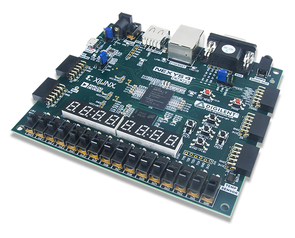

# Arquitectura-de-Computadoras
Repositorio destinado a los Trabajos Prácticos de la materia Arquitectura de Computación.

**Integrantes:**
- Federica Mayorga
- Gaston Marcelo Segura

---

Para la implementacion de esta serie de trabajos practicos, utilizamos la placa NEXYS4 DDR que es una plataforma de desarrollo de circuitos digitales completa y lista para usar basada en Artix-7™ Field Programmable Gate Array (FPGA) de Xilinx®.

     
    <em>Fig 1. Placa FPGA utilizada</em>

