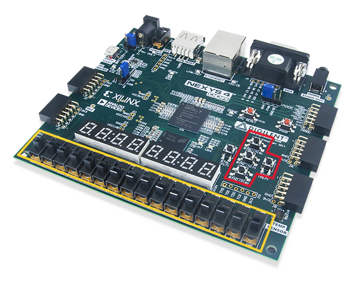
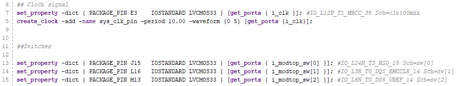
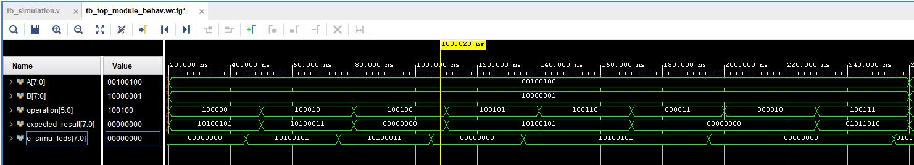
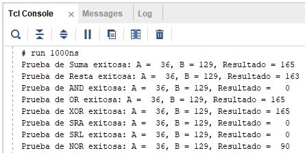

# Trabajo Practico #1 - ALU 

## Objetivo

El objetivo es desarrollar una Unidad Lógica Aritmética (ALU) parametrizable, que pueda operar sobre un bus de datos configurable. Esta ALU se implementará en una placa NEXYS 4 con FPGA Artix-7 y se validará mediante un Test Bench (banco de pruebas). Además, simularemos el diseño utilizando las herramientas de simulación de Vivado (Version 2023.1).
A continuación, se detallan los pasos necesarios para lograrlo:

- **Desarrollo de la ALU en lenguaje Verilog:**
  
    Crearemos una ALU simple, combinacional y parametrizable que pueda adaptarse a diferentes configuraciones de bus de datos, para implementar las operaciones aritméticas y lógicas necesarias en el diseño de la ALU.

    Las operaciones de la ALU son las siguientes:
    | Operaciones | Codigo |
    |:-----:|:-----:|
    | ADD | 100000 |
    | SUB | 100010 |
    | AND | 100100 |
    | OR | 100101 |
    | XOR | 100110 |
    | SRA | 000011 |
    | SRL | 000010 |
    | NOR | 100111 |

- **Implementación en FPGA:**
  
    Utilizaremos una FPGA para implementar físicamente nuestra ALU y le configuraremos los recursos para que coincidan con las especificaciones de la ALU.

- **Validación mediante Test Bench:**
  
    Crearemos un Test Bench que genere entradas aleatorias para la ALU y verificaremos que las salidas de la ALU sean correctas según las operaciones realizadas.

- **Simulación con Vivado:**
  
    Utilizaremos las herramientas de simulación de Vivado para simular el comportamiento de la ALU.

---

El siguiente es el diagrama con el cual nos guiamos para la implementación de este trabajo. Se observa el comportamiento de la ALU en su interacion con los switches y pulsadores de la placa, donde se dirigen los datos y el operador en direccion hacia la ALU. Donde finalmente vemos reflejado el resultado de la operacion en los LEDs de la placa.

     
    <em>Fig 1. Diagrama del Trabajo Practico.</em>

### Diseño

Realizamos dos modulos:
- `mod_ALU`, donde esta implementado el funcionamiento de la ALU.
- `mod_top`, donde esta instanciada la ALU, y se generan los demas componentes de la placa (swtiches, pulsadores, LEDs).

## Modulo ALU

Al comienzo, tenemos los parametros del modulo ALU: `NB_MODALU_DATA` y `NB_MODALU_OP`. Recordemos que los parametros son constantes.

La ALU esta compuesta por tres entradas (inputs) y una salida (output): 
  - Dos entradas, son las correspondientes para cada valor (`i_modALU_data_A` y `i_modALU_data_B`).
  - Una entrada, es para la operacion a realizar entre los dos valores (`i_modALU_OP`). 
  - La salida es el resultado de la operacion (`o_modALU_data_RES`).
estos son los puertos de nuestro modulo.

Los `wire` son un tipo de dato que representa una conexión física dentro del diseño, y no almacena ningún valor en sí mismo, los utilizamos para conectar los puertos como wires externos.

Estos son `signed` para saber si los valores y el resultado son numeros positivos o negativos, con lo cual, es el bit mas significativo (MSB) el que nos indicara el signo del numero.

Todos los valores de los puertos son parametrizables para que el modulo pueda ser reutilizado en futuros proyectos.

Como buscamos que nuestro modulo ALU sea lo mas combinacional posible, pero a la vez, necesitamos mantener cierta informacion sobre las operaciones del modulo, utilizamos una variable `reg`, la cual tambien es `signed` para poder mantener el signo de la operacion. Esta variable o registro, se denomina `tmp` por temporal.

Siendo a que queremos definir cual es la operacion a realizar, en base a los codigos obtenidos (tabla de operaciones), se implemento un case statement (o sentencia case). Para poder utilizar este `case(i_modALU_OP)`, tenemos que utilizarlo dentro de un bloque `always`. Los bloques `always` son construcciones que nos van a permitir declarar sentencias secuenciales, y al estar utilizandolo para una logica combinacional, su lista de sensibilidad es `@(*)`.

Dentro de nuestro case, tenemos las ocho operaciones diferenciadas por sus codigos. Y para nuestro bloque `always` hacemos asignaciones bloqueantes `=` ya que son las recomendadas para logica combinacional. Estas asignaciones se realizan secuencialmente en el orden en el que aparecen y no se realiza hasta que se completa la anterior.

En el caso de ingresar en el case, un valor distinto a los codigos operacionales, el resultado de salida (`default`) es poner en cero todos los LEDs.

Por ultimo, asignamos a `o_modALU_data_RES` el valor del registro `tmp`.

## Modulo TOP

De forma similar al **Modulo ALU**, para nuestro modulo `top_module`, situamos los parametros: `NB_MODTOP_DATA`, `NB_MODTOP_OP` y `NB_MODTOP_BUT`.

Luego, posicionamos los puertos. Tenemos:
- Una entrada, correspondientes a el clock `i_clk`.
- Una entrada, correspondientes a el reset `i_modtop_reset`.
- Una entrada, correspondientes a el switch `i_modtop_sw`.
- Una entrada, correspondientes a el boto pulsador `i_modtop_but`.
- Una salida, que sera el valor observado en los LEDs `o_modtop_leds`.

Ya con los parametros y puertos (entradas/salidas), declaramos las señales internas de `i_modtop_data_A`, `i_modtop_data_B` y `i_modtop_OP`.

Ahora, instanciamos el modulo ALU `mod_ALU_1`, declarando los parametros necesarios y los nombres de los puertos con sus conexiones correspondientes (como `.i_modALU_data_A(i_modtop_data_A)`).

Dentro del bloque `always`, observaremos que la lista de sensibilidad en este caso es `@(posedge i_clk)`, ya que dejamos de usar logica puramente combinacional y optamos por utilizar los eventos regulares, como los flancos de subida.

Utilizamos sentencias condicionales (de control de flujo), como `if(i_modtop_reset)` dado que al inicio de la ejecucion del codigo no sabemos los valores que tienen `i_modtop_data_A`, `i_modtop_data_B` y `i_modtop_OP`, entonces colocamos el boton de reset para inicializar todo a 0.

En la siguiente parte de `else`, vemos las asignaciones no bloqueantes `<=` que son las recomendadas para logica secuencial, correspondientes a los pulsadores 1, 2 y 3, desde `i_modtop_sw` ya que es un solo BUS de datos. Y vemos que en el ultimo condicional del bloque `always`, tenemos un truncamiento para el valor de `i_modtop_OP` ya que es un valor de hasta `NB_MODTOP_OP`.

El funcionamiento para la logica del mod_top es que al utilizar registros, para almacenar los valores de entrada y asi poder realizar las operaciones, recomendamos y pensamos en pulsar el boton de reset antes de almacenar dichos valores; al igual que posteriormente de hacer una operacion, y asi asegurarnos que los valores se pongan en cero.

Cargando los valores deseados en los switches de la placa, y luego presionando los pulsadores 1, 2 o 3, para asi desginar los valores a los registros denominados "dato A", "dato B" y "Operando".
En la imagen, vemos delimitado de color amarillo los switches y de color rojo, los pulsadores utilizados.

     
    <em>Fig 2. Switches y pulsadores.</em>

## Constraints

Dentro de este archivo, es donde se definen las conexiones fisicas de la placa y se le asignan las señales logicas que definimos en el codigo de Verilog. Es decir, donde se mapean las señales del diseño a los pines especificos de la placa FPGA y se establecen las propiedades electricas de dichos pines, como por ejemplo, el estandar de voltaje.

Nos encontramos con `set_property PACKAGE_PIN X [get_ports Y]`, que indica que la señal logica `Y` se conecta al pin fisico `X` en la FPGA. Tambien con `set_property IOSTANDARD LVCMOS33 [get_ports Y]`, que define el estandar de voltaje y los niveles de la señal, para el pin asociado a la señal `Y`. `LVCMOS33` es un estandar, y significa _Low Voltaje CMOS a 3.3V_, que es utilizado comunmente para señales de entrada y salida que operan a 3.3V. 

Tambien se definen diseños del clock (clk) como `create_clock -add -name sys_clk_pin -period 10.00 -waveform {0 5} [get_ports i_clk]`, que nos dara un reloj virtual para la señal de reloj `i_clk`, que es frecuentemente utilizado durante la sintesis y los analisis de tiempo de FPGA. Su periodo sera de 10 nanosegundos [10.00ns], lo que es equivalente a una frecuencia de 100MHz. El borde de subida de la señal esta en [0.00ns] y el borde de bajada en [5.00ns], lo que es equivalente a un duty cycle del 50%. 

     
    <em>Fig 2. Ejemplo de Constraints.</em>

## Test Bench

Es aca donde verificaremos nuestro diseño, en Verilog dentro de Vivado. Porque imitamos un laboratorio fisico para probar el circuito y generamos las señales de entrada, para asi poder evaluar las salidas del mismo. 

De forma similar a los modulos anteriores, declaramos los parametros y variables necesarias. Y en las particularidades de este tipo de archivo/simulacion, hacemos uso del bloque `initial`, en donde creamos el estímulo del componente a testear, su inicialización. Aparecen valores como `#N` donde es el delay de N unidades de escala de tiempo.

Utilizamos algunas funciones de testbench como `$display` para ver por consola ciertos valores, `$random` para la generacion de valores aleatorios dentro de las operaciones y `$finish` para frenar la simulacion. 

Observamos en la simulacion, los valores de los datos A y B, la operacion, el resultado esperado y el valor mostrado por la salida en los LEDs de la placa. Vemos un poco de retraso en las lineas de tiempo entre `o_simu_leds` y `expected_result`, pero en el funcionamiento de la placa, vemos que esta correcto a lo esperado.

     
    <em>Fig 3. Test Bench en binario.</em>

     
    <em>Fig 4. Test Bench en decimal.</em>

Tambien dentro del codigo, realizamos una funcion que nos indique por consola, si la operacion fue exitosa, al comparar el resultado esperado con el resultado obtenido. Simplemente con leer las salidas de la consola, sabremos si nuestras operaciones se comportan de la forma deseada.

     
    <em>Fig 5. Mensajes por consola.</em>

