# Trabajo Practico #3 - MIPS Processor Pipeline

     

## Objetivo
El objetivo es describir el desarrollo e implementación de un pipeline de ejecución para un procesador MIPS utilizando Verilog. Se detallaran las etapas del pipeline, que son:
- Instruction Fetch (IF)
- Instruction Decode (ID)
- Execute (EX)
- Memory Access (MEM)
- Write Back (WB)

El pipeline de ejecución esta preparado para manejar las siguientes instrucciones:
- R-Type:
    - SLL, SRL, SRA, SLLV, SRLV, SRAV, ADDU, SUBU, AND, OR, XOR, NOR, SLT
- I-Type:
    - LB, LH, LW, LWU, LBU, LHU, SB, SH, SW, ADDI, ANDI, ORI, XORI, LUI, SLTI, BEQ, BNE, J, JAL
- J-Type:
    - JR, JALR

Además, se ha desarrollado una aplicación que permite ensamblar el código y cargar instrucciones en el procesador, facilitando la ejecución continua o paso a paso. Durante este proceso, la aplicación muestra el estado de los registros y la memoria. Por otro lado, el procesador implementado cuenta con la capacidad de detectar y eliminar los riesgos estructurales, de datos y de control, asegurando así un funcionamiento eficiente y libre de errores.

---

## Etapas de ejecución

Cada etapa del pipeline se encarga de ejecutar una parte específica del procesamiento de una instrucción. Gracias a la segmentación del procesador, es posible iniciar la ejecución de una nueva instrucción en cada ciclo de reloj, siempre que no existan riesgos. Esto implica que, simultáneamente, cada etapa del pipeline estará procesando tareas correspondientes a diferentes instrucciones.

Para que este funcionamiento sea posible, es necesario incorporar buffers entre las etapas. Estos buffers se encargan de mantener las entradas de cada etapa durante un ciclo de reloj y actualizarlas con las salidas generadas por la etapa anterior al comienzo del siguiente ciclo.

A continuación, se presenta una figura que ilustra un pipeline básico de un procesador MIPS, mostrando sus etapas y los buffers asociados:

    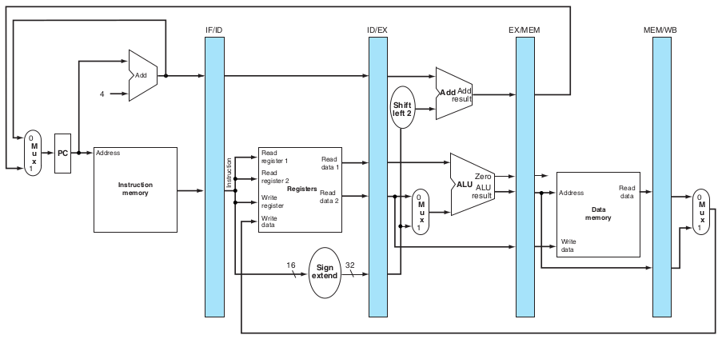 
    <em>Pipeline básico del MIPS.</em>

A continuación, se describen en detalle cada una de las etapas (o stages) que han sido implementadas en el pipeline.

## Instruction Fetch (IF)

    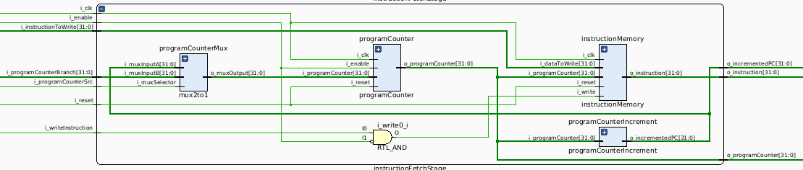 
    <em>Esquematico de instructionFetchStage.</em>

Esta etapa se encarga de acceder a la instrucción señalada por el valor del program counter (PC) en la memoria de instrucciones, presentándola como salida para su posterior uso en la siguiente etapa. Además, permite la escritura de nuevas instrucciones en la memoria de instrucciones, asegurando la flexibilidad del sistema.

Los módulos que conforman esta etapa son los siguientes:

- ``programCounter``: Este módulo mantiene el valor del program counter durante un ciclo de reloj. Si se activa la señal de reinicio, el contador se reinicia a cero. En cada flanco de reloj, el contador se actualiza según el valor de entrada, siempre que la señal de habilitación esté activa.

- ``programCounterIncrement``: Es un sumador que incrementa el program counter en 4 para apuntar a la siguiente instrucción, teniendo en cuenta que las instrucciones están alineadas a 4 bytes en la memoria.

- ``instructionMemory``: Este módulo almacena las instrucciones del programa. Permite leer la instrucción correspondiente al program counter. La memoria tiene 2^10 = 1024 direcciones, como cada dirección almacena una palabra de 4 bytes, el tamaño total en bytes es de 4096 bytes = 4 KB.

- ``programCounterMux``: Multiplexor que selecciona la fuente del program counter. Las opciones incluyen el PC actual incrementado en 4 o el PC resultante de una instrucción de salto. Se implementa mediante un multiplexor de 2 a 1. Este multiplexor es de vital importancia para el program counter, sus entradas provienen del modulo branchcontrol(decide si el procesador debe realizar un salto o continuar con la ejecución secuencial) que se encuentra en la etapa de instruction decode e indica cual sera la fuente del PC en funcion de la decisión que calculó el modulo branchcontrol.

## Instruction Decode (ID)

    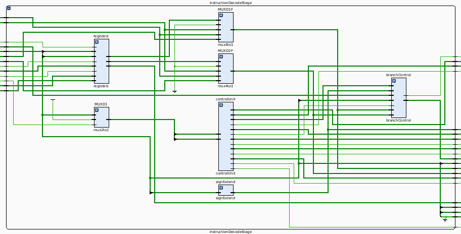 
    <em>Esquematico de instructionDecodeStage.</em>

En esta etapa, la instrucción entregada es decodificada para extraer diversos componentes esenciales: el código de operación, los registros implicados, valores inmediatos y el código de función. A partir de esta decodificación, se generan **señales de control** específicas que guían la ejecución correcta en las etapas posteriores del pipeline.

Esta etapa comprende los siguientes submódulos:

- ``registers``: Banco de registros, que proporciona almacenamiento temporal y acceso rápido a los datos necesarios para las instrucciones. Este módulo soporta la lectura y escritura de múltiples registros según las señales de control proporcionadas. Tenemos 32 registros de 32 bits.
- ``controlUnit``: Responsable de generar las señales de control necesarias para todas las etapas. Entre estas señales destacan el control de salto (``o_jumpType``, ``o_branch``), selección de operaciones aritméticas (``o_aluOp``), etc.
- ``signExtend``: Extiende los valores inmediatos a 32 bits según el bit de signo, permitiendo la correcta representación de números negativos en operaciones aritméticas y de salto.
- ``branchControl``: Unidad encargada del cálculo de la dirección de salto y la evaluación de la condición de branch. Su función es crítica en la implementación de instrucciones de saltos y la resolución de dependencias de control.
- ``MUXD1``: Multiplexor encargado de insertar **stalls** en el pipeline en respuesta a las señales de control, garantizando la sincronización del flujo de datos. Su salida, segun si es un stall o la instruccion a ejecutar, es entrada de la control unit que generara las señales de control.
- ``MUXD1F`` y ``MUXD2F``: Multiplexores que seleccionan la fuente de los datos entre diferentes opciones: la salida del banco de registros, el cortocircuito desde la etapa de memoria o la etapa de ejecución. La unidad de cortocircuito controla estos mux para evitar stalls innecesarios y optimizar el flujo del pipeline.

## Execute (EX)

    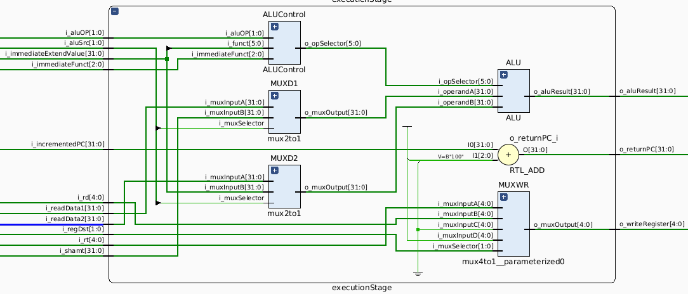 
    <em>Esquematico de executionStage.</em>

En esta etapa se llevan a cabo los cálculos requeridos por las instrucciones, como operaciones aritméticas, lógicas y de comparación. Los resultados obtenidos se utilizan en las siguientes etapas del pipeline para completar la ejecución del programa.

Módulos que componen esta etapa:

- ``ALUControl``: Este módulo interpreta las señales de control provenientes de la etapa de decodificación y determina el código de operación correspondiente para la ALU (``o_opSelector``). Las señales que controla incluyen operaciones como suma, resta, desplazamientos (shift) y comparaciones.
- ``MUXD1`` y ``MUXD2``: Estos multiplexores seleccionan los operandos para la ALU en función del tipo de instrucción (controlados por la señal ``i_aluSrc``, que determina la fuente de los operandos). ``MUXD1`` permite elegir entre el primer operando o un valor de desplazamiento, mientras que ``MUXD2`` selecciona entre el segundo operando o un valor inmediato.
- ``ALU``: La Unidad Aritmético-Lógica recibe los operandos y el código de operación proporcionado por ``ALUControl`` y realiza operaciones como suma, resta, AND, OR, XOR, NOR, desplazamientos lógicos y comparaciones.
- ``MUXWR``: Multiplexor que decide el registro de destino donde se almacenará el resultado de la ``ALU``. Las opciones incluyen el registro de destino especificado en la instrucción, el registro ``$zero`` o tambien ``$ra``.

## Memory Access (MEM)

    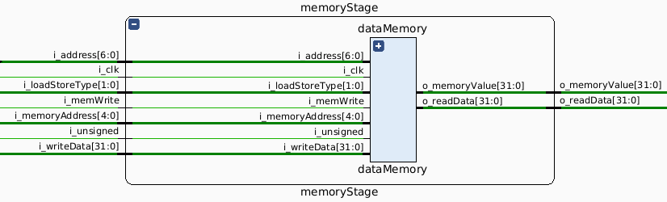 
    <em>Esquematico de memoryStage.</em>

En esta etapa se realizan las operaciones de lectura y escritura sobre la memoria de datos, necesarias para completar la ejecución de ciertas instrucciones del programa.

Esta etapa está compuesta por los siguientes módulos:

- ``dataMemory``: Módulo encargado de la lectura y escritura de datos en memoria. La dirección de memoria y los datos a escribir son proporcionados por la ``ALU`` y el registro de datos. El control de escritura se realiza mediante la señal ``i_memWrite``. El tamaño de los datos (byte, halfword o word) se selecciona mediante la señal ``i_loadStoreType``, y la interpretación del signo se controla con la señal ``i_unsigned``.
- ``memoryMask``: Este módulo ajusta el formato de los datos leídos de la memoria según el tamaño especificado (_BYTE_, _HALFWORD_ o _WORD_). También se encarga de extender el signo si los datos son interpretados como valores con signo.
- ``branchControl``: Aunque su función principal es calcular las direcciones de salto y evaluar condiciones para instrucciones de tipo branch, este módulo también se relaciona con el control de flujo en la memoria cuando se procesan estas instrucciones.

El flujo general es el siguiente: al recibir una señal de escritura (``i_memWrite`` activa), se almacena el valor indicado en la dirección especificada, respetando el tamaño y formato seleccionados. Para la lectura, se extraen los datos de la dirección correspondiente, ajustándolos según las configuraciones de tamaño y signo antes de ser enviados a la siguiente etapa.

## Write Back (WB)

    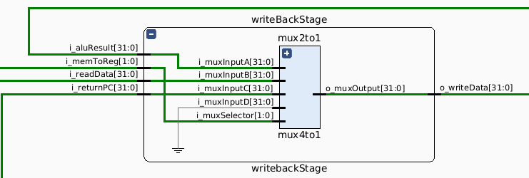 
    <em>Esquematico de writebackStage.</em>

En esta etapa se realiza la escritura de los resultados en los registros, tomando el valor adecuado según la instrucción ejecutada. El proceso está controlado por un multiplexor interno, que selecciona cuál de los valores disponibles será finalmente almacenado en el registro de destino.

Módulos que componen esta etapa:

- ``writebackStage``: Este módulo coordina el flujo de datos hacia los registros. Recibe tres posibles valores de entrada: el resultado de la ALU (``i_aluResult``), un dato leído desde la memoria (``i_readData``), y la dirección de retorno (``i_returnPC``). El multiplexor interno, controlado por la señal ``i_memToReg``, selecciona el valor correcto para ser enviado como salida (``o_writeData``). Las opciones son:
  - **00**: Selección del resultado de la ALU.
  - **01**: Selección del dato leído de la memoria.
  - **10**: Selección de la dirección de retorno.

En adicion a las etapas o stages referidos y representados a lo largos de este informe, se encuentra un ultimo buffer.

- ``memoryWritebackBuffer``: Este módulo actúa como un buffer entre la etapa de memoria y la etapa de escritura. Almacena los datos y señales de control necesarios para completar la escritura en el registro correspondiente.
  - Controla el registro en el que se debe escribir mediante la señal ``i_writeRegister``.
  - Permite habilitar o deshabilitar la escritura con la señal ``i_regWrite``.
  - Implementa un mecanismo de freno (``i_halt``) y permite reiniciar el contenido con la señal ``i_reset``.

El flujo de trabajo general comienza con la selección del valor a escribir, que es determinado por el multiplexor en función de las señales de control. Luego, este valor es almacenado en el registro correspondiente, asegurando la correcta actualización de los datos para las siguientes instrucciones.

---

## Riesgos
Para la detección y eliminación de riesgos se agregaron dos módulos sobre la implementacion ya mencionada:

### Forwarding Unit

    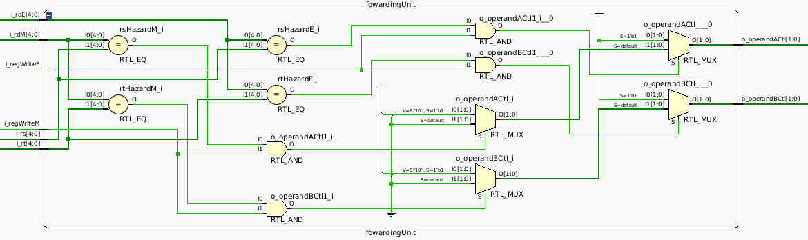 
    <em>Esquematico de forwardingUnit.</em>

Esta unidad es responsable de generar señales que gestionan los multiplexores utilizados en la etapa de decodificación para modificar la fuente de los operandos utilizados por la ALU en la etapa de ejecución. Su función principal es detectar y resolver riesgos de datos, eliminándolos mediante la generación de "cortocircuitos" (forwarding).

El funcionamiento del módulo es comparar los registros involucrados en las diferentes instrucciones presentes en el pipeline para identificar posibles riesgos de datos. Estos riesgos ocurren cuando una instrucción utiliza datos que aún no han sido escritos por una instrucción anterior.

Podemos identificar algunas de sus entradas y salidas:
- ``i_rs`` y ``i_rt``: Registros fuente de la instrucción actual.
- ``i_rdE`` y ``i_rdM``: Registros de destino de las instrucciones en las etapas de ejecución y memoria, respectivamente.
- ``i_regWriteE`` y ``i_regWriteM``: Señales de control que indican si las instrucciones en las etapas de ejecución y memoria escribirán en un registro.
- ``o_operandACtl`` y ``o_operandBCtl``: Señales de control de dos bits que determinan la fuente de los operandos A y B:
  - **00**: Sin cortocircuito, el operando proviene directamente del banco de registros.
  - **10**: Cortocircuito desde la etapa de memoria.
  - **11**: Cortocircuito desde la etapa de ejecución.

---
La detección de riesgos se basa en las siguientes condiciones:
- Si ``i_rdE`` coincide con ``i_rs`` y la señal ``i_regWriteE`` está activa, se genera un cortocircuito para el operando A.
- Si ``i_rdE`` coincide con ``i_rt`` y la señal ``i_regWriteE`` está activa, se genera un cortocircuito para el operando B.

---
Condiciones similares se aplican para las comparaciones con ``i_rdM`` y la señal ``i_regWriteM``, que indican riesgos en la etapa de memoria.

En cuanto a la **implementación de la anticipación de resultados**, se añaden dos mutiplexores(en la etapa de instructionDecode) a la entrada de la ALU y el control apropiado para detectar estas dependencias y anticipar los resultados cuando sea necesario. El primer multiplexor recibe el registro A proveniente de la etapa anterior, el resultado de la instrucción anterior que se encuentra a la salida de la ALU(etapa EX), y el resultado de la instrucción anterior de la anteirior que se encuentra a la salida de la memoria(etapa M). El otro multiplexor recibe estas dos mismas señales junto con el registro B. El control de los multiplexores se lleva a cabo por esta unidad, que es la que va a decidir que entrada usar. Debido a que algunas instrucciones no escriben en registros, se anticiparía un valor innecesario, por esto es que se comprueba si la señal RegWrite esta activa(esta señal de contrl indica que la instruccion va a escribir un registro); esto se logra examinando el campo de control WB del registro de segmentación durante las etapas de EX y MEM.

    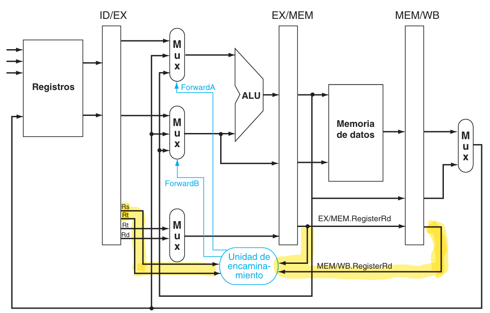 
    <em>forwardingUnit.</em>

De este modo, la unidad de forwarding garantiza que los datos necesarios estén disponibles para las instrucciones actuales, evitando que el pipeline se detenga por riesgos de datos.

### Hazard Detector

    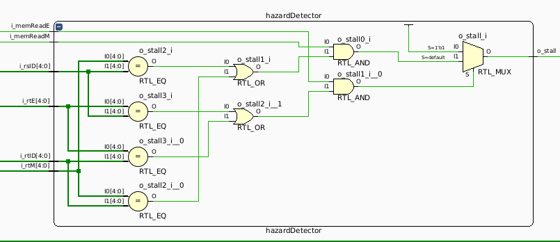 
    <em>Esquematico de hazardDetector.</em>

Este módulo es responsable de la detección de riesgos, tanto de datos como de control, en el pipeline. Cuando se identifica un riesgo, se inserta una burbuja (stall) para dar tiempo a que el riesgo se resuelva antes de que la instrucción que lo provoca avance.

El funcionamiento esta en la detección de riesgos, que se realiza mediante la comparación de registros fuente de las instrucciones en la etapa de decodificación con los registros destino de las instrucciones en etapas anteriores, así como mediante la evaluación de las señales de control.

Podemos identificar algunas de sus entradas y salidas:
- ``i_rsID`` y ``i_rtID``: Registros fuente de la instrucción en la etapa de decodificación.
- ``i_rtE`` y ``i_rtM``: Registros destino de las instrucciones en las etapas de ejecución y memoria, respectivamente.
- ``i_memReadE`` y ``i_memReadM``: Señales que indican si las instrucciones en las etapas de ejecución y memoria están leyendo de la memoria.
- ``o_stall``: Señal que se activa cuando se detecta un riesgo, lo que provoca la inserción de una burbuja en el pipeline.

---
Si una instrucción en la etapa de ejecución tiene activada la señal ``i_memReadE`` y su registro destino (``i_rtE``) coincide con alguno de los registros fuente (``i_rsID`` o ``i_rtID``) de la instrucción en la etapa de decodificación, se activa la señal ``o_stall``.
Si una instrucción en la etapa de memoria tiene activada la señal ``i_memReadM`` y su registro destino (``i_rtM``) coincide con alguno de los registros fuente de la instrucción en decodificación, se activa la señal ``o_stall``.

Esta unidad es la que ayuda a poder realizar el cortocircuito cuando existe previamente una instruccion LOAD. Se da cuenta que es esta instruccion al ejecutar i_memRead ya que LOAD es la única instrucción que lee de memoria. Al bloquearse la instruccion situada en la etapa de ID tambien se bloquea la instrucción que esta en la etapa IF, ya que sino perdería la instrucción buscada de memoria. La mitad posterior del pipeline que comienza en la etapa EX ejecuta instrucciones NOPs, esto se logra negando(poniendo a cero) las señales de control de las etapas EX/MEM y WB. Este proceso se logra a partir de un multiplexor que se encuentra en la etapa de instruction decode, el cual su salida es la entrada de la control unit(la cual es la encargada de generar las señales de control), por lo tanto si el selector del mux indica que existe un stall provoca que las señales de control que salen de la control unit sean = 0.

    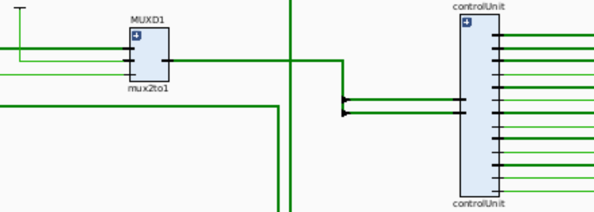 
    <em>Mux de instruction decode.</em>

---

Este mecanismo asegura que el pipeline no avance hasta que el riesgo desaparezca, garantizando una ejecución correcta de las instrucciones en presencia de dependencias de datos.

## Unidad de debug

    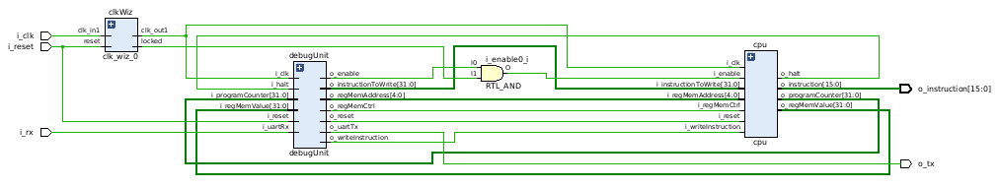 
    <em>Esquematico de top.</em>

Se implementó una unidad de depuración conectada al procesador, diseñada para facilitar la programación, depuración y ejecución del mismo. Esta unidad está compuesta por los siguientes módulos:

- ``UART``: Este módulo es responsable de recibir comandos desde una PC y enviar el estado del procesador. Actúa como la interfaz de comunicación serie entre el sistema de depuración y la PC, utilizando un protocolo UART para asegurar una transmisión confiable.
- ``DebugInterface``: Se encarga de interpretar los comandos recibidos desde el módulo UART. Este módulo analiza las instrucciones para determinar la acción que debe llevarse a cabo sobre el procesador, tales como:
  - Establecer puntos de interrupción (breakpoints).
  - Iniciar o detener la ejecución del procesador.
  - Leer o escribir valores en registros específicos.
  - Consultar el estado de la memoria del procesador.

    El ``debugInterface`` también contiene lógica de control para coordinar el acceso a los registros internos del procesador y manejar las señales de control requeridas durante el proceso de depuración.

    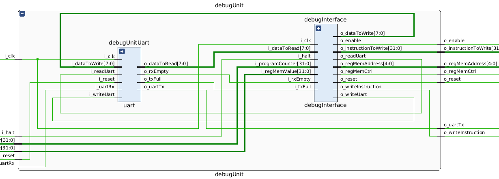 
    <em>Esquematico de debugUnit.</em>

- ``DebugUnit``: Este módulo es el núcleo que conecta todos los elementos de la unidad de depuración. Además de gestionar la interacción entre la ``UART`` y el ``debugInterface``, se encarga de mantener un registro del estado del procesador y proporcionar acceso en tiempo real al mismo para el envío de datos de depuración.

    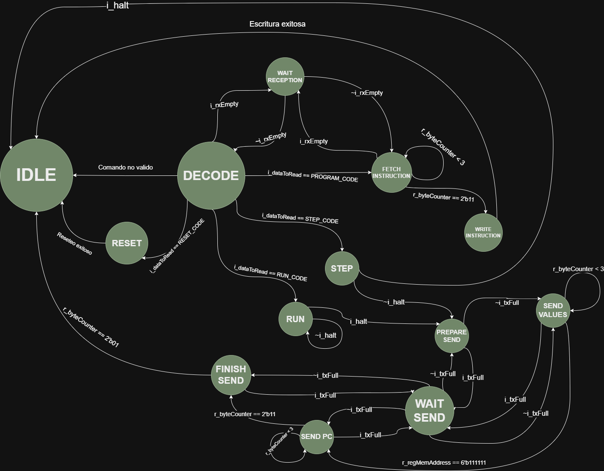 
    <em>Diagrama de estados de la MS en Debug Unit.</em>

En el diagrama de estados, varias señales y registros juegan un papel crucial en la coordinación entre la UART y la CPU:
- ``i_rxEmpty``: Señala si la UART ha recibido datos que aún no han sido leídos.
- ``i_dataToRead``: Contiene los datos que se han leído desde la UART.
- ``i_txFull``: Indica si la UART está lista para aceptar nuevos datos para transmisión.
- ``i_halt``: Informa si la CPU ha detenido su ejecución.
- ``r_byteCounter``: Realiza el conteo de los bytes recibidos o enviados.
- ``r_regMemAddress``: Almacena la dirección de memoria del registro al que se está accediendo.

## Interfaz

    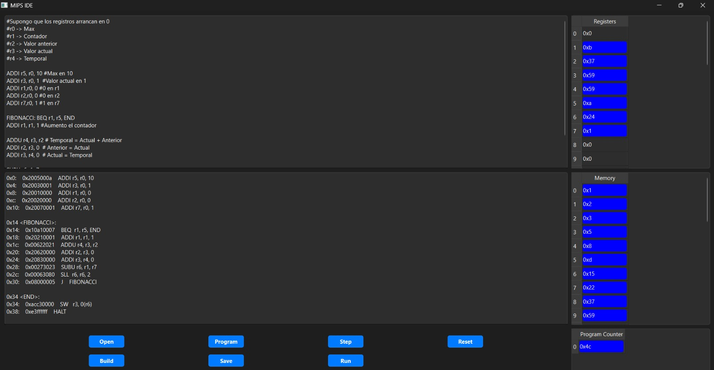 
    <em>Presentacion de la aplicacion.</em>

Se desarrolló una aplicación llamada **PyMips** para facilitar la programación y el control del procesador. La aplicación puede ejecutarse fácilmente corriendo el archivo ``mipsIde.py`` (en _Linux_) o ``mipsIdeWin.py`` (en _Windows_). Antes de iniciar, es necesario configurar el puerto de comunicación serial correspondiente para asegurar la conexión con la placa del procesador.

Funcionalidades principales de la interfaz son las siguientes:
- **Editor de Código**: Un cuadro de texto amplio permite escribir el código fuente en lenguaje ensamblador MIPS.
- **Visor de Código Ensamblado**: Otro cuadro muestra el código ensamblado después de realizar el proceso de construcción (build).
- **Visualización de Registros y Memoria**: Tablas dinámicas muestran el contenido actual de los registros del procesador y la memoria de datos, junto con el contador de programa (PC).

Los diferentes botones y sus funciones son:
- **Build**: Ensambla el código fuente y muestra el código máquina resultante.
- **Program**: Envía el programa ensamblado al procesador mediante la interfaz serial.
- **Run**: Ejecuta el programa en el procesador.
- **Step**: Permite la ejecución paso a paso para facilitar la depuración.
- **Reset**: Reinicia el procesador y el programa cargado.
- **Save**: Guarda el código fuente en un archivo ``.asm``.
- **Open**: Abre un archivo de código fuente para cargarlo en el editor.

La comunicación se realiza mediante un módulo ``UART`` configurado a _115200 baudios_, con la función de transmitir y recibir comandos e instrucciones entre la PC y la placa del procesador.

Esta aplicación ofrece una plataforma visual y fácil de usar para la programación, depuración y ejecución de programas en el procesador MIPS.

## Análisis temporal
Se llevaron a cabo pruebas para determinar la frecuencia máxima de operación del sistema completo, que incluye tanto el procesador como la Debug Unit. Los resultados indicaron que la mayor frecuencia estable alcanzada fue de **57MHz**. Al aumentar la frecuencia, el sistema genera la siguiente advertencia:

  

    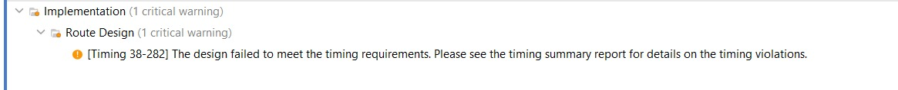 
    <em>Warning de frecuencia en VIVADO.</em>
  

  

    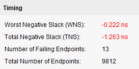 
    <em>Prueba de máxima frecuencia en VIVADO.</em>
  

En cambio, en una frecuencia menor a la mayor frecuencia estable, nos demuestra que el sistema se mantiene en perfectas condiciones, sin la presencia de paths criticos, donde no se cumple con los requisitos de timing. Siguiendo esta metodología, la menor frecuencia alcanzada fue de 10MHz.

    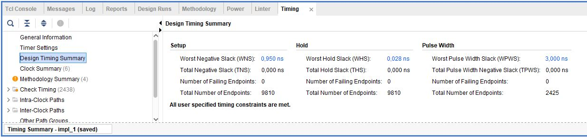 
    <em>Design timing summary intermedio observado.</em>

Y vemos como en este rango de frecuencias de **57 - 10MHz**, no obtenemos mas critical warnings, los requisitos de timing fueron alcanzados y hasta en la metrica de **WNS** (Worst Negative Slack) valores positivos, lo cual significa que incluso para el path mas critico del diseño "sobro" tiempo del periodo de la señal utilizada.

  

    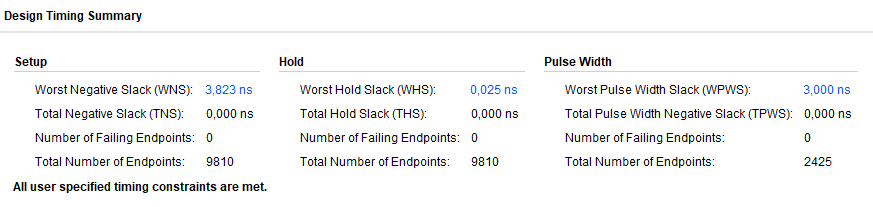 
    <em>Design timing summary observado.</em>
  

  

    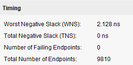 
    <em>Prueba de mínima frecuencia en VIVADO.</em>
  

